# 💻🔥 AI Dev Tools: GitHub, OpenAI & Microsoft

---

## 🚀 Why AI Tools Are Lit for Devs

AI tools are the GOAT for coding rn. GitHub, OpenAI, and Microsoft dropped some 🔥 tools that help devs go from 💡 idea to 💾 secure code. They boost speed, cut errors, and make dev life way easier. But fr, picking the right one is kinda a maze.

---

## 🧠 What’s in This Unit?

We’re vibing with these tools:

- Azure AI Services  
- Azure AI Foundry Portal  
- AI Builder  
- Copilot Studio  
- Semantic Kernel SDK  
- Visual Studio IntelliCode  
- ChatGPT  
- GitHub Copilot  

---

## ☁️ Azure AI Services

Cloud-based AI magic. No ML degree needed. Handles speech, vision, NLP, and decision stuff. Plug it into your app and boom—smarter UX.

### 🔧 Use it if:
- You want AI but don’t wanna build models from scratch.
- You need quick AI features like speech or image stuff.

---

## 🧪 Azure AI Foundry Portal

Drag-n-drop ML builder. No code, no stress. Works with TensorFlow & PyTorch. Build, train, deploy—all in one place.

### 🔧 Use it if:
- You wanna play with ML models without writing code.
- You’re a data nerd or dev who wants easy AI tools.

---

## 🛠️ AI Builder

Part of Power Platform. Add AI to apps with zero data science skills. Prebuilt models + custom ones = win.

### 🔧 Use it if:
- You’re a biz analyst or citizen dev.
- You wanna automate stuff like form reading or predictions.

---

## 🤖 Copilot Studio

Make chatbots that actually get you. No devs needed. Design convos, train bots, and track how they’re doing.

### 🔧 Use it for:
- Customer support, FAQs, health info, HR stuff.
- Bots that live in Teams, websites, or mobile apps.

---

## 🧩 Semantic Kernel SDK

Wanna mix AI with your own code? This SDK is your BFF. Use OpenAI, Azure, Hugging Face, etc. Build agents that do real work.

### 🔧 Use it if:
- You’re coding in C#, Python, or Java.
- You want AI to actually *do* things in your app.

---

## 🧠 Visual Studio IntelliCode

Smart code helper in VS. Learns from tons of repos. Suggests code, helps refactor, and keeps your style clean.

### 🔧 Use it if:
- You want faster, cleaner coding.
- Your team wants consistent code vibes.

---

## 💬 ChatGPT

Talk to AI like it’s your dev buddy. Great for ideas, debugging, and learning. Not perfect for coding, but solid for brainstorming.

### 🔧 Use it if:
- You need help understanding stuff.
- You’re building chatbots or assistants.

---

## 👨‍💻 GitHub Copilot + Chat

Your AI coding sidekick. Writes code, explains it, fixes bugs, and even makes test cases. Works in your IDE and GitHub.

### 🔧 Use it if:
- You want to code faster with fewer bugs.
- You need help understanding or documenting code.

---

## 🧠 TL;DR

AI tools = dev superpowers. Whether you’re a pro or just starting, these tools make coding faster, smarter, and way more fun. Pick your tool, level up, and let AI do the heavy lifting. 💪

# 🤖💥 GitHub Copilot Plans: Which One’s Your Coding Sidekick?

## 🚀 Why Copilot Is a Game-Changer

GitHub Copilot = your AI coding buddy. It vibes with all the top languages and makes devs way more productive. Microsoft + GitHub did the research—Copilot boosts your real-world coding flow big time.

Works with:
- VS Code  
- Visual Studio  
- Vim/Neovim  
- JetBrains IDEs  

---

## 💸 Copilot Plans Breakdown

### 🆓 **Copilot Free**
- For solo devs not in orgs
- Try basic AI coding help
- Limited features

### 💼 **Copilot Pro**
- Unlimited completions  
- Premium models in Copilot Chat  
- Monthly premium request allowance  
- Free for verified students, teachers, OSS maintainers

### 💎 **Copilot Pro+**
- Everything in Pro  
- More premium requests  
- Full access to all models  
- For AI power users

### 🧑‍💻 **Copilot Business**
- For orgs on GitHub Free/Team or Enterprise Cloud  
- Centralized management + policy control

### 🏢 **Copilot Enterprise**
- For GitHub Enterprise Cloud users  
- All Business features + enterprise-grade extras  
- Assign plans org-wide

---

## 📊 Feature Comparison Tables

### 💰 Pricing

| Feature | Free | Pro | Pro+ | Business | Enterprise |
|--------|------|-----|------|----------|------------|
| Premium requests | 50/mo | 300/mo | 1500/mo | 300/user/mo | 1000/user/mo |
| Buy more requests | ❌ | ✅ | ✅ | ✅ | ✅ |

---

### 🧠 Agents

| Feature | Free | Pro | Pro+ | Business | Enterprise |
|--------|------|-----|------|----------|------------|
| Agent mode in VS Code | ✅ | ✅ | ✅ | ✅ | ✅ |
| Code review | Basic only | ✅ | ✅ | ✅ | ✅ |
| Extensions | ✅ | ✅ | ✅ | ✅ | ✅ |

---

### 💬 Chat

| Feature | Free | Pro | Pro+ | Business | Enterprise |
|--------|------|-----|------|----------|------------|
| Chat in IDEs | 50 msgs/mo | Unlimited | Unlimited | Unlimited | Unlimited |
| Inline chat | ✅ | ✅ | ✅ | ✅ | ✅ |
| Slash commands | ✅ | ✅ | ✅ | ✅ | ✅ |
| Chat in GitHub Mobile | ✅ | ✅ | ✅ | ✅ | ✅ |
| Chat in GitHub | ✅ | ✅ | ✅ | ✅ | ✅ |
| Chat in Windows Terminal | ✅ | ✅ | ✅ | ✅ | ✅ |
| Higher model limits | ❌ | ❌ | ✅ | ✅ | ✅ |
| Chat skills in IDEs | ❌ | ✅ | ✅ | ✅ | ✅ |

---

### 🧬 Models

| Model | Free | Pro | Pro+ | Business | Enterprise |
|-------|------|-----|------|----------|------------|
| Claude 3.5 Sonnet | ✅ | ✅ | ✅ | ✅ | ✅ |
| Claude 3.7 Sonnet | ❌ | ✅ | ✅ | ✅ | ✅ |
| Claude 3.7 Thinking | ❌ | ✅ | ✅ | ✅ | ✅ |
| Gemini 2.0 Flash | ✅ | ✅ | ✅ | ✅ | ✅ |
| Gemini 2.5 Pro | ❌ | ✅ | ✅ | ✅ | ✅ |
| GPT-4o | ✅ | ✅ | ✅ | ✅ | ✅ |
| GPT-4.1 | ✅ | ✅ | ✅ | ✅ | ✅ |
| GPT-4.5 | ❌ | ❌ | ✅ | ❌ | ✅ |
| o1 | ✅ | ✅ | ✅ | ✅ | ✅ |
| o3 | ❌ | ❌ | ✅ | ❌ | ✅ |
| o3-mini | ✅ | ✅ | ✅ | ✅ | ✅ |
| o4-mini | ❌ | ✅ | ✅ | ✅ | ✅ |

---

### 🧑‍💻 Code Completion

| Feature | Free | Pro | Pro+ | Business | Enterprise |
|--------|------|-----|------|----------|------------|
| Real-time suggestions | 2000/mo | ✅ | ✅ | ✅ | ✅ |
| Next edit suggestions | ✅ | ✅ | ✅ | ✅ | ✅ |

---

### 🎨 Customization

| Feature | Free | Pro | Pro+ | Business | Enterprise |
|--------|------|-----|------|----------|------------|
| Repo & personal instructions | ✅ | ✅ | ✅ | ✅ | ✅ |
| Org instructions (preview) | ❌ | ❌ | ❌ | ❌ | ✅ |
| Prompt files | ✅ | ✅ | ✅ | ✅ | ✅ |
| Private extensions | ✅ | ✅ | ✅ | ✅ | ✅ |
| Code review guidelines | ❌ | ❌ | ❌ | ❌ | ✅ |
| Block public code suggestions | ✅ | ✅ | ✅ | ✅ | ✅ |
| Exclude files | ❌ | ❌ | ✅ | ✅ | ✅ |
| Org-wide policy mgmt | ❌ | ❌ | ✅ | ✅ | ✅ |

---

### 🧩 Other Features

| Feature | Free | Pro | Pro+ | Business | Enterprise |
|--------|------|-----|------|----------|------------|
| PR summaries | ❌ | ✅ | ✅ | ✅ | ✅ |
| Audit logs | ❌ | ❌ | ✅ | ✅ | ✅ |
| Knowledge bases | ❌ | ❌ | ❌ | ❌ | ✅ |
| Fine-tune LLM (preview) | ❌ | ❌ | ❌ | ❌ | ✅ |
| Copilot in CLI | ✅ | ✅ | ✅ | ✅ | ✅ |

---

## 🧠 TL;DR

GitHub Copilot’s got a plan for everyone—from solo devs to mega enterprises. Pick the one that fits your vibe, your team, and your coding goals. 💻✨

# 🧠⚡ GitHub Copilot Features: What’s Hot & What’s Dropping

## 🚀 Copilot = Your AI Coding Sidekick

GitHub Copilot’s got a growing list of features for solo devs and orgs. Some are 🔒 exclusive, others are 🔓 public preview. What you get depends on your plan.

---

## 🧩 Core Features (General Availability)

### ✨ Code Completion
- Autocomplete vibes in VS Code, Visual Studio, JetBrains, Azure Data Studio, Xcode, Vim/Neovim, Eclipse.
- In VS Code: “Next edit suggestions” predict your next move and help you code faster.

---

### 💬 Copilot Chat
- Ask coding Qs, update files, get help.
- Available in GitHub Web, GitHub Mobile, IDEs (VS Code, Visual Studio, JetBrains, Eclipse, Xcode), and Windows Terminal.
- GitHub Skills in Chat (not in Free plan).

---

### 🛠️ Copilot Edits
Edit across files from one chat prompt.

- **Edit Mode**: You control the files, context, and edits.
- **Agent Mode**: Copilot takes the wheel, edits code, runs terminal commands, and fixes stuff until the task’s done. (Only in VS Code)

---

### 🔍 Code Review
AI-powered suggestions to help you write cleaner, smarter code.

---

### 🧑‍💻 Copilot in the CLI
Chat with Copilot in your terminal. Ask for command help, get suggestions, and explanations. Works in Windows Terminal Canary too.

---

### 📦 Pull Request Summaries
Copilot auto-generates summaries of PR changes, impacted files, and review tips. (Not in Free plan)

---

### 🧪 Copilot Extensions
Plug external tools into Copilot Chat via GitHub Apps. Build your own or grab from GitHub Marketplace.

---

### 🧠 Custom Instructions
Tell Copilot your coding style, tools, and preferences to get better responses.

---

### 📚 Knowledge Bases (Enterprise Only)
Create doc collections to use as context in Copilot Chat. Ask smarter questions in GitHub or VS Code.

---

## 🧠 TL;DR

Copilot’s stacked with features to level up your coding game. From smart suggestions to full-on AI agents, it’s built to boost your dev flow. What you get depends on your plan, but even the basics are 🔥.

# ⚙️🧠 GitHub Copilot Setup: Get Your AI Coding Buddy Online

---

## 👤 Setup for Solo Devs

### 🔍 Pick Your Plan
- **Copilot Free**: 2K completions + 50 chats/month. No 💸 needed.
- **Copilot Pro**: 30-day free trial + 300 premium requests/month.
- **Copilot Pro+**: 1500 premium requests + full model access.
- **Org/Enterprise Access**: Ask your team for access.
- **Students/Teachers/OSS Maintainers**: You might get it free!

---

### 🧩 Install the Extension
Copilot works in:
- VS Code  
- Visual Studio  
- JetBrains IDEs  
- Vim/Neovim  
- Eclipse  
- Xcode  

### 💻 CLI & Terminal Setup
- Install Copilot for GitHub CLI  
- Use Copilot Chat in Windows Terminal Canary  

---

### 🌐 Networking Setup (If Needed)
- Add key URLs to proxy/firewall allowlist  
- Install custom SSL certs if required  

---

### ⚙️ Optional Settings
- Tweak Copilot settings in IDE or CLI  
- Add Copilot Extensions  
- Manage your own policies  

---

## 🏢 Setup for Organizations

### 💼 Subscribe Your Org
- Choose **Copilot Business** or **Copilot Enterprise**
- Enterprise owners can enable org-wide access

### 🔐 Set Policies
- Control which features are available

### 🌐 Networking Setup
- Add key URLs to allowlist  
- Install SSL certs on member machines  

### 👥 Grant Access
- Enable Copilot for key teams first  
- Use self-service license claiming for smooth rollout  
- Enterprise users need to authenticate from their IDE  

---

### 🚀 Drive Adoption
- Plan your rollout  
- Start with excited teams  
- Show early wins  

---

### 🔧 Enhance the Experience
- Set up knowledge bases (Enterprise only)  
- Fine-tune with custom LLMs  
- Add Copilot Extensions  

---

## 🆓 Copilot Free Access

### 🚫 Not Available If:
- You’re a managed user  
- You’re assigned via org  
- You already have Pro/Pro+ or trial  
- You’re using a free Pro plan as a student/teacher/maintainer  

### ✅ How to Start:
- **VS Code / Visual Studio**: Sign up from the editor  
- **GitHub Web**: Go to Settings → Your Copilot → Start using Copilot Free  
- **GitHub Mobile**: Tap the Copilot icon → Ask Copilot  
- **Other IDEs**: Activate from GitHub → Pick your editor → Install  

---

## 🧠 TL;DR

Copilot setup = easy mode.  
Solo devs: pick a plan, install, tweak settings.  
Orgs: subscribe, set policies, roll it out smart.  
Copilot’s ready to code with you. 💻🔥

# ⚙️🧠 GitHub Copilot in VS Code: Setup & Settings

---

## 🚀 What’s the Deal?

Copilot plugs straight into VS Code, Visual Studio, and other IDEs. In VS Code, it uses **two extensions**:

- **GitHub Copilot**: Handles code completions + comment-based suggestions  
- **GitHub Copilot Chat**: Lets you chat with your AI coding buddy  

---

## 🔧 Install Copilot in VS Code

No manual install needed—Copilot extensions auto-install with default settings.

### 🛠️ Steps:
1. Open VS Code (make sure it’s updated)
2. Hover over the Copilot icon in the Status Bar → click **Set up Copilot**

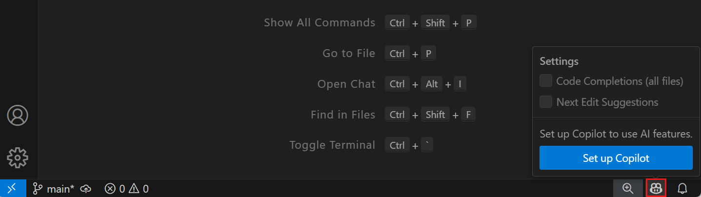

3. Hit **Sign in** to log into GitHub  
   - Already signed in? You’ll see **Use Copilot** instead  
4. Follow the prompts to authenticate + authorize  
5. Boom! Extensions install in the background  

📍 You can find them in the **Extensions view** in VS Code.

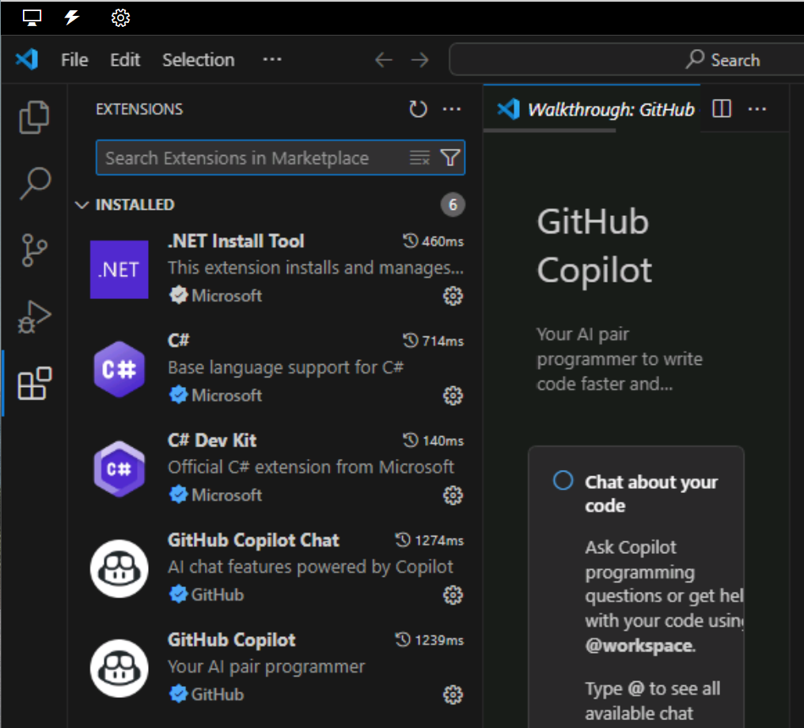
---

## ⚙️ Configure Copilot Settings

Customize how Copilot behaves in VS Code.

### 🧩 Access Settings:
- Click the ⚙️ **Manage** icon (bottom-left corner)
- Select **Settings**

### 🔧 Extension Settings:
- **Copilot Extension**: Manage languages + AI models  
- **Copilot Chat Extension**: Control chat interactions  


---

## 🧠 TL;DR

Copilot in VS Code = plug & play.  
Two extensions, auto-installed.  
Customize settings to match your coding vibe.  
Let AI help you code smarter, faster, better. 💻🔥

# 🛠️👤 GitHub Copilot: Manage Your Plan Like a Pro

---

## 🚀 What You Can Control

If you're flying solo (not in an org plan), you’ve got full control over your Copilot setup. You can:

- Manage your plan  
- Tweak your settings  
- Add extensions  
- Control privacy & features  

> ⚠️ If you’re part of an org with Copilot Business/Enterprise, some settings might be locked. Talk to your account manager.

---

## ⚙️ Feature Toggles

### 🔧 Enable/Disable Stuff:
- **Copilot Chat in GitHub**  
- **Copilot Chat in GitHub Desktop**  
- **Web Search via Bing**  
- **Alt AI Models**: Claude Sonnet, Gemini  

### 🔐 Privacy Settings:
- **Block public code matches**  
  - Copilot checks ~150 chars of your code against public GitHub code  
  - If matched, it won’t show the suggestion  
- **Allow public code matches**  
  - See match details + repo links  
- **Prompt/Suggestion Collection**  
  - Opt in/out of GitHub using your snippets for product improvements  
- **Model Training**  
  - Your data won’t be used for training—this is locked off by default  

---

## 🧩 Extensions FTW

### 🔌 Copilot Extensions:
- Add extra tools via GitHub Marketplace  
- Must have Copilot Free, Pro, or Pro+ to use  
- Org users don’t need to install—admins handle it  

### 🛠️ Build Your Own:
- Create custom Copilot Extensions for your personal account  

---

## ⚠️ Know the Limits

### 📉 Performance Vibes:
- Scope is limited—some languages or complex code may trip it up  
- JavaScript = 🔥, niche languages = 🤷‍♀️  

### 🧠 Bias Alert:
- Trained on public code = possible bias or errors  
- May favor certain styles or languages  

### 🔐 Security Watch:
- Generated code might leak sensitive info  
- Always test + review before deploying  

### 🧪 Public Code Matches:
- Low chance, but not zero  
- Treat Copilot code like any third-party snippet  
- Run IP scans, security checks, and manual reviews  

### ❌ Inaccurate Code:
- Looks good ≠ works good  
- Review for syntax, logic, and architecture fit  

### 🤖 Non-Code Qs:
- Copilot Chat isn’t built for general knowledge  
- Might give weird or wrong answers  

---

## 🧠 TL;DR

You’ve got the power to shape your Copilot experience.  
Toggle features, manage privacy, install extensions, and stay smart about what Copilot generates.  
Use it like a pro, test everything, and keep your code clean. 💻🔥

## 🚀 GitHub Copilot: Code Completion Cheat Sheet

---

### 🔮 What Copilot Does

GitHub Copilot is like your coding BFF. It watches what you type and throws in smart code suggestions — kinda like autocomplete but way smarter.

You’ll get suggestions when you:
- Type part of a code line 💻
- Write a comment 🗯️
- Leave a blank line ⬜

---

### ⚡ Speed Boost for Devs

Say you’re writing a C# method called `addInt` to add two numbers. Start typing and boom 💥 — Copilot finishes it for you.

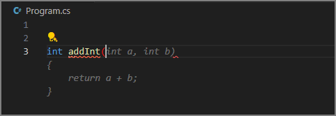

No syntax colors = Copilot’s suggestion. Hit `Tab` to accept.  
Hit `Esc` to say “nah.”
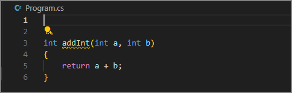
---

### 🧠 Smarter Than It Looks

Let’s level up. You want a method that adds only prime numbers from a list. Start typing `addPrimeNumbersInNumericList` and Copilot’s got your back.

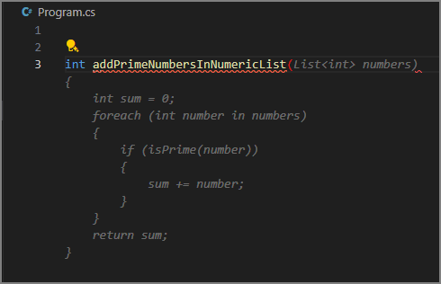

Looks good? Hit `Tab`.  
But wait — `isPrime` is red ❌. It’s missing.

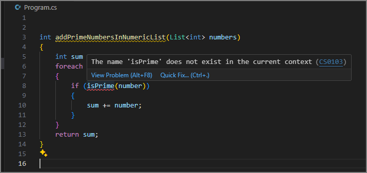

Copilot knows best practices. It suggests you write `isPrime` separately.

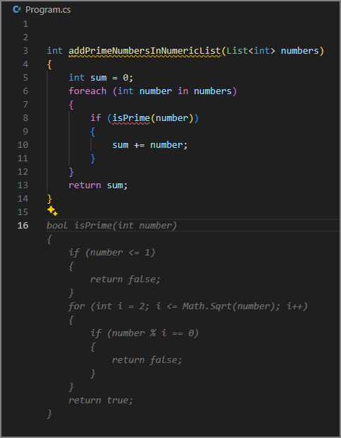

---

### 🛠️ Managing Suggestions

Hover over a suggestion and you’ll see:
- ✅ Accept (or press `Tab`)
- 🧩 Accept Word (`Ctrl + >`)
- 🔄 View others (`Alt + ]` or `Alt + [`)

Want more control? Click `...` for:
- 📏 Accept Line
- 📌 Always Show Toolbar
- 🧭 Open Completions Panel

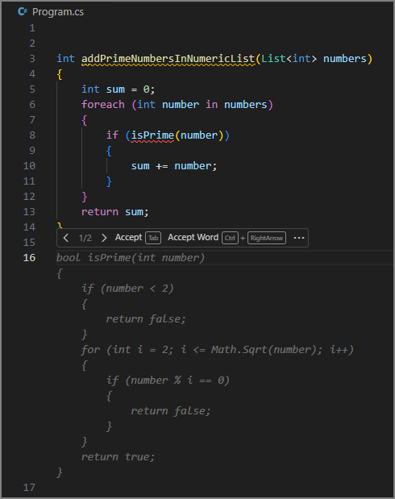
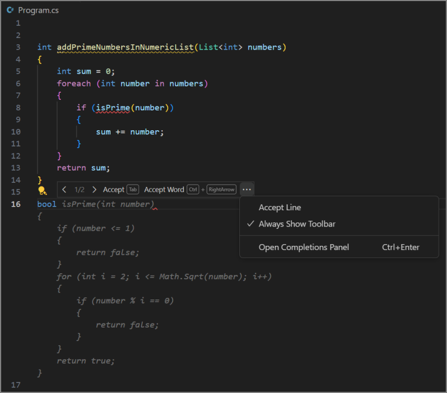
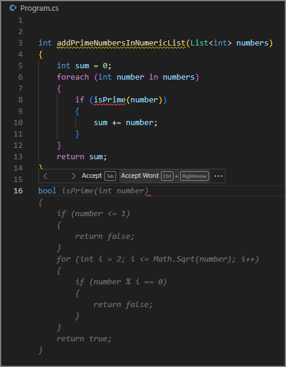
---

### 💬 Comments = Code

Copilot reads your comments like magic spells 🪄.  
Write something like:

```csharp
// create a list of 100 random numbers between 1 and 1000
Copilot finishes the comment and starts generating code.
```

When you start entering the comment, GitHub Copilot suggests an autocompletion that completes the comment for you.


Accept each line as it appears.
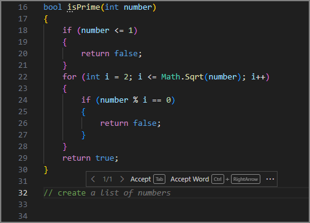

When you create a new code line after the comment, GitHub Copilot begins generating a code snippet based on the comment and your existing code.
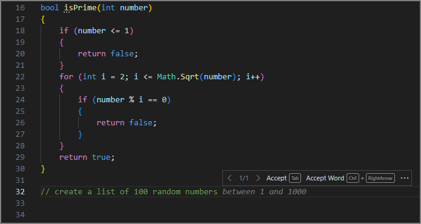

Accept each of the suggestions as they appear.
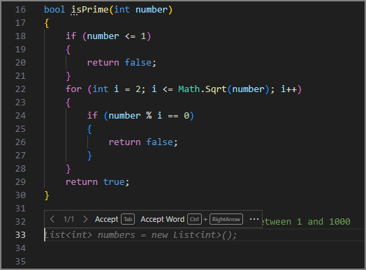

If GitHub Copilot isn't done, it generates another suggestion for you to accept.


If you enter a new code line after the code snippet is complete, GitHub Copilot generates another autocomplete suggestions based on the requirements of your code project
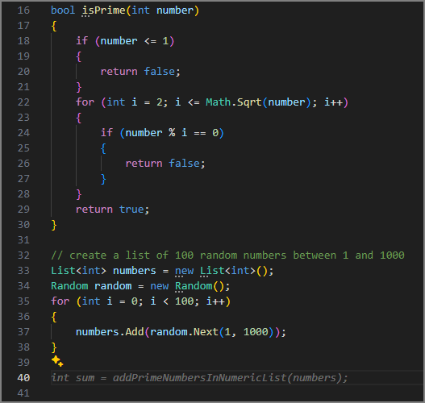


🧭 Explore More Suggestions
Not vibing with the first suggestion?
Press Ctrl + Enter or open the More Actions menu → Open Completions Panel.

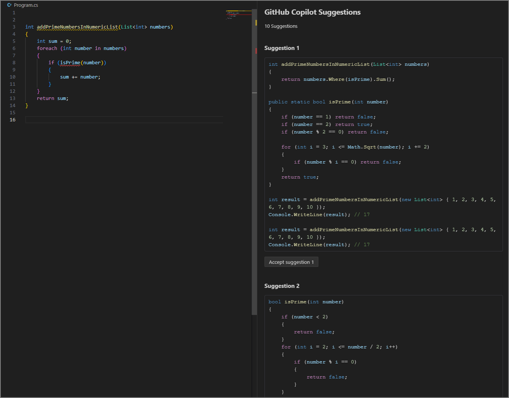

You’ll see up to 10 options. Pick your fave or close the tab to reject all.

🧾 TL;DR
Copilot helps you code faster and smarter:

Type code, comments, or blank lines to get suggestions.
Accept with Tab, dismiss with Esc.
Use the toolbar to manage suggestions.
Comments can trigger full code snippets.
Open the Suggestions tab for more options.

# 🚀 GitHub Copilot Chat: Your AI Coding Sidekick

---

## 💬 What Is It?

GitHub Copilot Chat is built into **VS Code** and helps you code smarter, faster, and with less stress. It’s like having a coding buddy who *never sleeps* 😎.

---

## 🛠️ How You Can Use It

- 🧠 **Chat View** – Ask anything, anytime.
- ✍️ **Inline Chat** – Get help *while* you code.
- ⚡ **Smart Actions** – Let Copilot do stuff without typing prompts.
- 💨 **Quick Chat** – Fast Q&A with your AI pal.

---

## 🧩 What It Can Do

### 📚 Explain & Document Code  
Highlight code ➡️ Copilot tells you what it does in plain English. Great for team collabs or showing non-tech folks what’s up.

### ❓ Answer Coding Questions  
Stuck? Ask Copilot. It replies with code or easy-to-read answers.

### 🐞 Fix Bugs  
Got errors? Copilot suggests fixes based on your code and error messages.

### 🧪 Generate Unit Tests  
Need tests? Copilot writes them for you—inputs, outputs, edge cases, all covered.

### 🔧 Suggest Code Improvements  
Copilot helps you level up your code:
- ✨ Cleaner & easier to read
- 🛡️ More reliable
- ⚡ Faster performance
- 🔐 Better security

---

## 🧠 How It Works

1. **Input** – You type code or a question.
2. **AI Brain** – Copilot reads it using a huge language model.
3. **Response** – It gives you code, fixes, or explanations.
4. **Formatting** – Replies are neat, readable, and sometimes include links.

---

## ⚠️ Heads-Up

Copilot’s smart, but not perfect. Always double-check its answers before using them in your project.

---

## 📝 TL;DR

GitHub Copilot Chat is your AI coding buddy in VS Code. It helps with:
- Explaining code
- Answering questions
- Fixing bugs
- Writing tests
- Improving your code

Powered by AI + machine learning = smarter dev life 💻✨

# 💬 GitHub Copilot Chat View: Your AI Coding Hub

---

## 🖥️ What’s the Chat View?

The Chat View in **VS Code** is where you chat with your AI coding buddy.  
It lives in the **Secondary Side Bar** (right side of the window).


### 🧭 Layout:
- 🔝 Toolbar at the top  
- 📺 Display area in the middle  
- 🎛️ Input + controls at the bottom

To open it:  
- Click the **Copilot icon**  
- Or hit **Ctrl+Alt+I**

---

## 🔄 Chat Modes

### 🧠 Ask Mode  
Ask questions about your code or tech stuff.  
Great for:
- Explaining code
- Suggesting fixes
- Learning concepts

### ✏️ Edit Mode  
Make changes across files.  
Use it to:
- Refactor code
- Add comments
- Clean things up

### 🤖 Agent Mode  
Let Copilot take over and run tasks for you.  
It can:
- Execute commands
- Edit files
- Handle workflows

To switch modes:  
Click **Set Mode** at the bottom → Choose **Ask**, **Edit**, or **Agent**

⚠️ **Heads-Up:**  
Agent mode might use **premium requests** depending on task complexity.

---

## 🧩 Add Context to Your Chat

Better context = smarter answers.

### 📝 Ways to add context:
- Type it in your prompt
- Use chat variables like `#selection`

### ➕ Use the **Add Context** button to:
- 📁 Add files & folders
- 📜 Add instructions
- 🐞 Add problems
- 🔣 Add symbols
- 🖼️ Add screenshots
- 💻 Add terminal output
- 🔍 Add search results
- ❌ Add test failures
- 🧰 Add tools (e.g. `#fetch`)
- 📂 Add recent files
---

## 🧠 Ask Mode Deep Dive

Ask about your project, tech topics, or coding help.  
Copilot replies with:
- Natural language
- Code snippets
- Helpful info

To apply a code block to your codebase, hover over the code block and select the Apply in Editor button. Copilot tries to apply the proposed changes to your existing code.
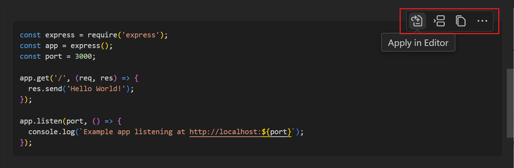

If a code block contains a shell command, you can run it directly in the integrated terminal with the Insert into Terminal (Ctrl+Alt+Enter) action.
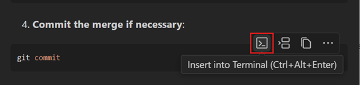

### 🧠 Smart Code Suggestions

When Copilot gives you code:
- Hover over it
- Click **Apply in Editor** to insert it smartly
- Or copy/insert at cursor

💡 IntelliSense might work in code blocks too!

If it’s a shell command:
- Click **Insert into Terminal** (Ctrl+Alt+Enter)

---

## ✏️ Edit Mode Deep Dive

Use it to update code across files.  
Copilot shows:
- Suggested edits
- Updated files
- Options to **Keep** or **Undo**


You can:
- Scroll through changes
- Accept or tweak them
- Revert with **Undo Last Edit**
- Redo with **Redo Last Edit**

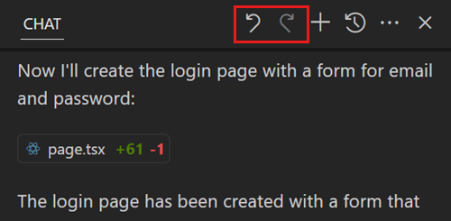

---

## 🤖 Agent Mode Deep Dive

Give Copilot a big task → It plans, edits, and executes.

It uses tools to:
- List files
- Edit code
- Run commands
- Get terminal output

### ✅ Confirm Before Running

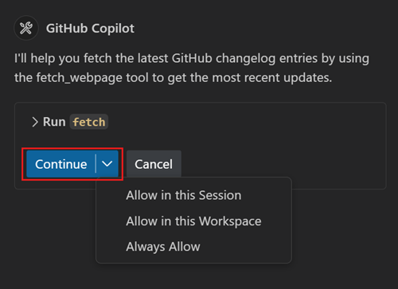

Before running tools or commands:
- Copilot asks for permission
- Use **Continue** dropdown to auto-confirm for:
  - Current session
  - Workspace
  - All future runs

---

## 📝 TL;DR Summary

- Chat View = your AI coding control center in VS Code
- Modes: **Ask**, **Edit**, **Agent**
- Add context for smarter replies
- Ask Mode = Q&A + code help
- Edit Mode = code updates across files
- Agent Mode = full-on AI automation

Copilot Chat = smarter coding, less stress 💻✨

# 💬 Copilot Chat: Inline, Smart, & Quick Modes

---

## ✍️ Inline Chat: Code While You Chat

Ask questions *right inside* your code editor. No switching tabs. No distractions.

### 🔓 How to open:
- 🧭 Copilot Chat menu → Editor Inline Chat  
- ⌨️ Shortcut: Ctrl + I  
- 🖱️ Right-click → Copilot → Editor Inline Chat

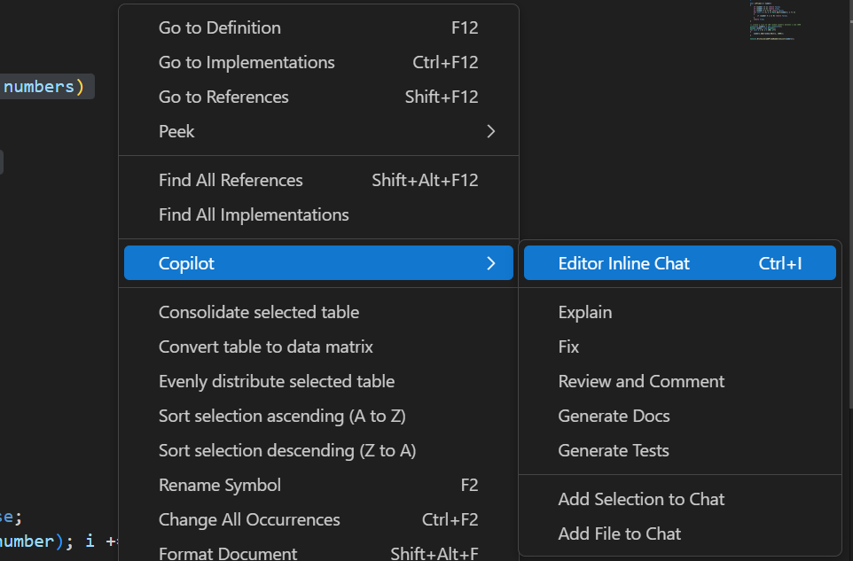

You can use an inline chat session to ask Copilot questions as you write or iterate your code.
When you open an inline chat session, the following interface is presented in the Editor.


### 💡 Use Case:
You're coding a C# app that makes a list of 100 random numbers.  

```csharp
// create a list of 100 random number between 1 and 1000
List<int> numbers = new List<int>();
Random random = new Random();
for (int i = 0; i < 100; i++)
{
    numbers.Add(random.Next(1, 1000));
}
```

Now you need to **remove duplicates**. Instead of rewriting everything:

1. Highlight the code  
2. Hit Ctrl + I  
3. Ask: “Update this code to remove duplicates” 
4. Review → Accept or Rerun 🔁 
5. Not happy? Add more context or hit Discard ❌

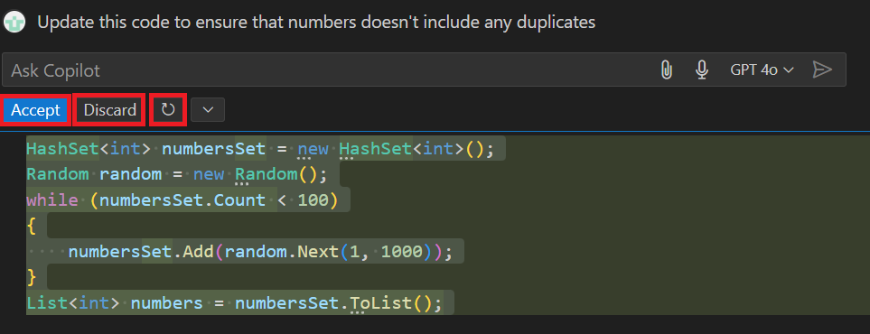

---

## ⚡ Smart Actions: No Prompt Needed

Right-click a code snippet → Choose a smart action from the Copilot menu.
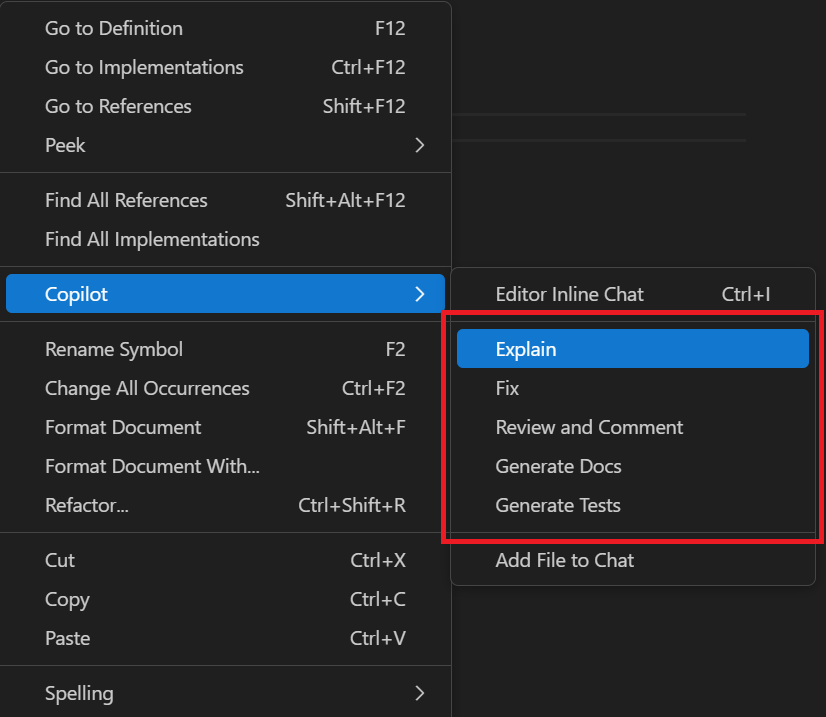

### 🧠 Available Actions:
- **Explain** – What does this code do?  
- **Fix** – Got bugs? Copilot suggests fixes.  
- **Review & Comment** – Get feedback + best practices.  
- **Generate Docs** – Auto-doc your code.  
- **Generate Tests** – Create unit tests instantly.

### 🧪 Example:
You used inline chat to make a list of unique numbers.  
Now use **Review This** to improve it:

Copilot suggests:
- Use `HashSet<int>` for faster lookups  
- Pre-size the list to avoid resizing

But wait! Your method expects a `List<int>` 😬  
Use **Fix** smart action → Copilot adds `.ToList()` to fix it.

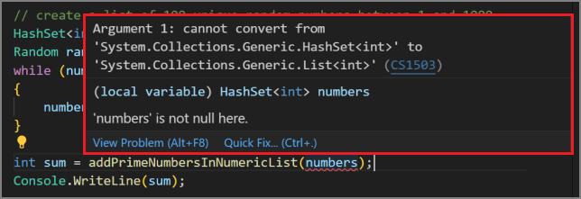

```csharp
HashSet<int> numbers = new HashSet<int>();
Random random = new Random();
while (numbers.Count < 100)
{
    int randomNumber = random.Next(1, 1000);
    if (!numbers.Contains(randomNumber))
    {
        numbers.Add(randomNumber);
    }
}

int sum = addPrimeNumbersInNumericList(numbers.ToList());
Console.WriteLine(sum);
```
## 💨 Quick Chat: Fast & Friendly AI Help
Need help right now? Use Quick Chat for instant convos with Copilot.

- 🔓 How to open:
- ⌨️ Ctrl + Shift + Alt + L
- 🧭 Copilot Chat menu → Quick Chat

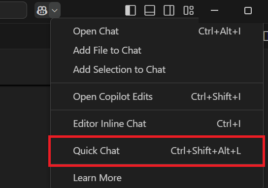
Great for:

- Debugging
- Brainstorming
- Understanding code

Feels like chatting with a dev buddy 👯‍♂️

## 📝 TL;DR Summary
GitHub Copilot Chat gives you 3 awesome ways to interact:

- ✍️ Inline Chat – Ask while coding
- ⚡ Smart Actions – Fix, explain, review, test, doc
- 💨 Quick Chat – Fast convos with your AI dev buddy

Smarter coding. Less typing. More building 💻🚀
