# 🚀 GitHub Copilot: Explain & Document Like a Pro!

GitHub Copilot is your AI coding buddy in VS Code. It helps you understand tricky code and write docs without breaking a sweat. Let’s break it down 👇

---

## 🧠 Explain Code (aka “What does this do?”)

Use these Copilot features to decode your code:

- **Ask Mode:**  
  Chat with Copilot about your whole project. Ask anything—code stuff, tech ideas, or best practices.

- **Inline Chat:**  
  Highlight code, ask questions right in the editor. Boom—instant answers.

- **Smart Actions – Explain:**  
  Select code → Right-click → Hit “Explain.” No typing needed.

- **Quick Chat:**  
  Got a quick Q? Ask away and keep coding.

---

## 📄 Document Code (aka “Make it readable!”)

Copilot helps you write clean, clear docs for your code:

### 🔹 Inline Docs

- **Ask Mode:**  
  Ask Copilot to write docs for files, classes, or methods. Review in chat, tweak, and insert.

- **Edit Mode:**  
  Get doc suggestions in the editor. Accept, reject, or remix them.

- **Agent Mode:**  
  Let Copilot auto-doc your code. It can multitask too! Review when it’s done.

- **Inline Chat:**  
  Use `/doc` or just ask. Docs show up in the editor—accept, reject, or rerun.

- **Generate Docs Smart Action:**  
  Select code → Right-click → “Generate Docs.” Easy peasy.

### 🔹 Project Docs

- **Ask Mode (Chat View):**  
  Understand your whole codebase. Copilot suggests README.md content. You review and insert.

- **Edit Mode (Chat View):**  
  Create or update README.md with Copilot’s help.

- **Agent Mode (Chat View):**  
  Copilot builds a full doc set: README.md, UsageExamples.md, ChangeLog.md. It links stuff and keeps it all consistent.

---

## ⚠️ Heads-Up!

Using **Agent Mode** might trigger **premium requests**. These depend on:
- Task complexity
- Number of steps
- Model used

---

## 🎯 TL;DR

GitHub Copilot = Code explainer + Doc writer + Workflow booster  
Use chat, smart actions, and inline tools to level up your dev game in VS Code.

---

# 🔍 GitHub Copilot Prompts & Keywords: Level Up Your Chat Game!

GitHub Copilot Chat is like texting your super-smart coding buddy. It reads your messages (aka prompts) and replies with code help, docs, fixes, and more. But to get 🔥 answers, you gotta know how to talk to it right.

---

## 🧠 Prompt Power-Up Tips

Want better replies? Here's how to write top-tier prompts:

- **Be Clear + Specific:**  
  Instead of “How do I use this?”, try “Can you explain how `calculateTotal` works in `shoppingCart.js`?”

- **Break It Down:**  
  Long prompt? Use short sentences. Start with your goal, then add details.

- **Chunk It:**  
  Big ask? Split it into smaller parts. Like chatting with a human—set the scene, then dive into the details.

---

## 🧩 Use Keywords to Boost Your Prompts

Copilot Chat understands natural language *and* special keywords. These help it know exactly what you want.

### 👥 Chat Participants (`@`)
These are like expert teammates. Add them to your prompt with `@`:

- `@workspace`: Knows your codebase.
- `@vscode`: Knows VS Code features.
- `@terminal`: Knows terminal commands.
- `@github`: Searches GitHub + web stuff.

Example:  
`@workspace how can I validate a date?`

### ⛳ Slash Commands (`/`)

Slash commands tell Copilot *exactly* what you want.  
Wanna learn about code? `/explain`  
Need a fix? `/fix`  
Writing tests? `/tests`  
Just drop the right command and Copilot tunes its reply to match your vibe.

---

### 💡 Pro Tip: Combine with Chat Participants

Slash commands + chat participants = 🔥 results.

Example:
```plaintext
Create a new workspace with Node.js, Express, Pug, and TypeScript.
```
Cool, but kinda vague.

Better:

```Plain Text
@workspace /new Node.js Express Pug TypeScript
```

Now Copilot knows you want a fresh project with those tools.
It’ll even show you the folder structure and let you hit “Create Workspace” to build it.

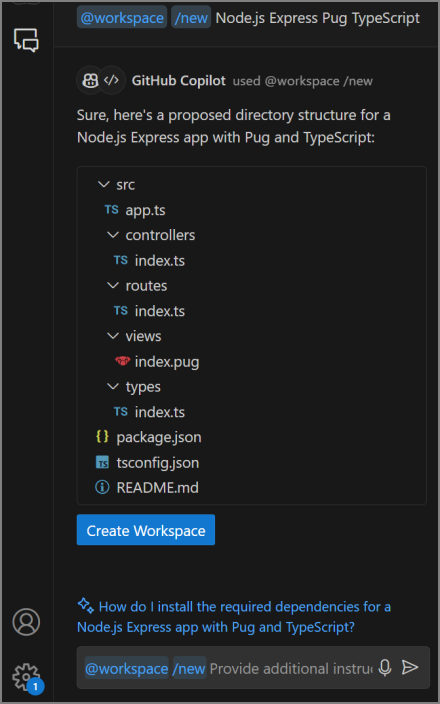

🧠 Why It Works
Slash commands = your intent (what you wanna do)
Chat participants = your context (where you're doing it)
Together, they help Copilot give you smarter, faster, and more useful answers.

🚀 Try These Combos

Use them like shortcuts to level up your dev game! 🧑‍💻⚡

These tell Copilot what you’re trying to do:

- `/help`: Get help.
- `/doc`: Write docs.
- `/clear`: Start fresh.
- `/explain`: Explain code.
- `/tests`: Make unit tests.
- `/fix`: Suggest a fix.
- `/new`: Create a new project.
- `/newNotebook`: Make a Jupyter Notebook.

Example:  
`@workspace /explain` → Copilot explains your whole workspace.
`@workspace /fix (or /fix)`: Propose a fix for the problems in the selected code.
`@workspace /tests (or /tests)`: Generate unit tests for the selected code.
`@vscode /api (or /api)`: Ask about Visual Studio Code extension development.
`@workspace /new (or /new)`: Scaffold code for a new workspace.
`@workspace /newNotebook` (or /newNotebook): Create a new Jupyter Notebook.

### 🧠 Chat Variables (`#`)
These give Copilot extra context. Use `#` to reference stuff:

- `#editor`: Code in the editor.
- `#selection`: Highlighted code.
- `#filename`: Add a file or folder.
- `#codebase`: Workspace content.
- `#terminalSelection`: Selected terminal text.
- `#terminalLastCommand`: Last terminal command.

Example:  
`Which sorting algorithm is used in #selection?`

---

## 🤔 @workspace vs #codebase

Both help Copilot understand your whole project, but they work differently:

- `@workspace`:  
  - Acts like a coding expert.  
  - Answers based on your codebase.  
  - Only works in Ask Mode.

- `#codebase`:  
  - Adds code context to your prompt.  
  - Works in Ask, Edit, and Agent modes.  
  - More flexible + tool-friendly.

GitHub recommends using `#codebase` for max flexibility.

---

## 🎯 TL;DR

To get 🔥 responses from GitHub Copilot Chat:
- Write clear, specific prompts.
- Break big asks into smaller chunks.
- Use `@participants`, `/commands`, and `#variables` to guide Copilot.

Now go chat like a coding legend! 💬💻✨

# 🧠 Analyze & Explain Code with GitHub Copilot

GitHub Copilot isn’t just for writing code—it’s your AI coding buddy that helps you understand what your code *actually* does. Whether you're building something new, fixing bugs, or just curious, Copilot’s got your back.

---

## 🔍 Features That Help You Decode Code

- **💬 Chat View:** Ask big questions about your project, tech concepts, or coding tools.
- **✍️ Inline Chat:** Ask about specific lines or blocks of code right in the editor.
- **⚡ Smart Actions – Explain:** Right-click code → Copilot → Explain. No typing needed.
- **⚡ Quick Chat:** Ask a fast question and jump back into coding.

---

## 💬 Chat View in Ask Mode

The Chat View lives in the right sidebar of VS Code. It’s where you chat with your AI pair programmer.

### 🛠️ How to Open:
- Click the Copilot icon
- Use the GitHub Copilot menu → Open Chat
- Shortcut: `Ctrl+Alt+I`

#### 🧠 What You Can Ask:
- “What’s a linked list?”
- “Top 10 web frameworks?”
- “@workspace /explain this method”
- “@workspace /fix this error”
- “@vscode how do I disable the minimap?”

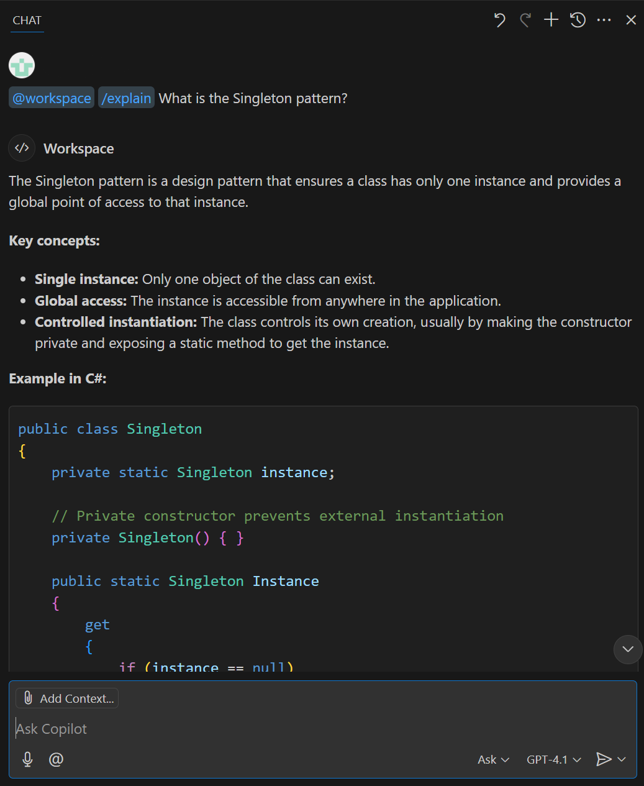

---

## 🧰 Chat View Features

- **Toolbar:** Manage chats, move or hide the view
- **Response Area:** Where Copilot drops answers, code, and tips
- **Add Context Button:** Pull in files or GitHub repos for smarter replies
- **Ask Copilot Box:** Type your prompt (use @, /, and # for extra power)
- **Voice Chat Button:** Talk to Copilot with your mic 🎙️
- **Extensions Button:** Add tools to boost your chat
- **Chat Mode Menu:** Switch between Ask, Edit, and Agent modes
- **Model Picker:** Choose your AI model (default = GPT-4o)
- **Send Menu:** Choose how to send your prompt

---

## ✍️ Inline Chat = Ask Right in the Code

Inline Chat lets you ask questions about specific code without leaving the editor.

### 🛠️ How to Open:
- GitHub Copilot menu → Editor Inline Chat
- Shortcut: `Ctrl+I`
- Close with `Esc`

### 🧠 What You Can Ask:
- `/explain #selection`
- `/explain Why does this throw an error?`
- `/explain Can LINQ make this cleaner?`

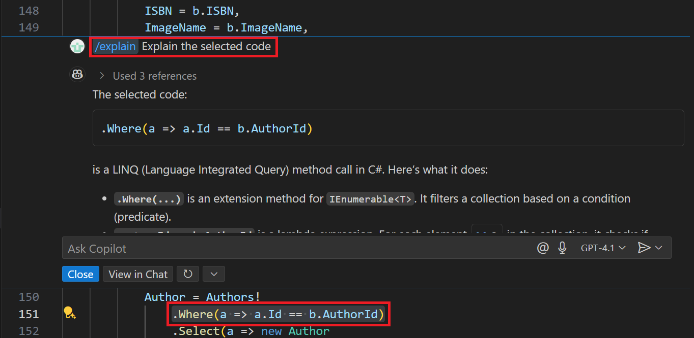

---

## 🧰 Inline Chat Features

- **Ask Copilot Box:** Type your prompt (slash commands + variables only)
- **Extensions Button:** Add tools for smarter replies
- **Voice Chat Button:** Talk instead of type
- **Model Picker & Send Menu:** Same as Chat View

---

## ⚡ Smart Action: Explain

Too lazy to type? Just right-click code and hit **Copilot → Explain**.  
Copilot will break it down in the Chat View.

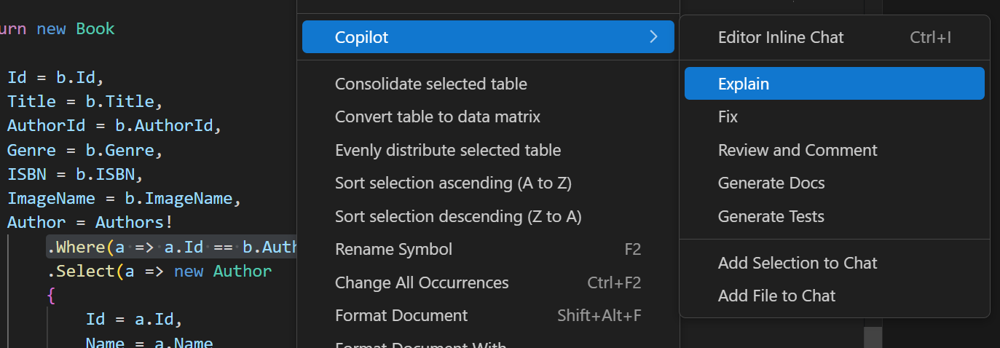

---

## ⚡ Quick Chat = Fast Q&A Mode

Need a quick answer without saving the convo? Use **Quick Chat**.

### 🛠️ How to Open:
- GitHub Copilot menu → Quick Chat
- Shortcut: `Ctrl+Shift+Alt+L`

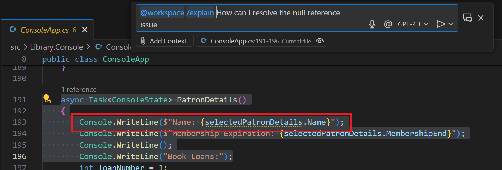

---

## 🎯 TL;DR

GitHub Copilot gives you **4 awesome ways** to analyze and explain code:

| Feature        | Best For                          |
|----------------|-----------------------------------|
| 💬 Chat View   | Full convos, deep dives           |
| ✍️ Inline Chat | Quick Qs about specific code      |
| ⚡ Smart Action| One-click code explanations       |
| ⚡ Quick Chat  | Fast answers, no chat history     |

Use them to level up your code game, learn faster, and debug smarter. 💡💻🔥

# 📚 Generate Project Docs with GitHub Copilot

Project docs = your project's story. They explain what it does, why it matters, and how to use it. GitHub Copilot makes writing docs easy by analyzing your whole project and helping you build files like `README.md`, `UsageExamples.md`, and `ChangeLog.md`.

---

## 🧠 Why Use Copilot for Docs?

Copilot can:
- Understand your project structure
- Summarize components + how they work together
- Generate docs in markdown format
- Link files and keep everything consistent

---

## 🛠️ Modes for Doc Creation

Copilot has **three modes** for generating docs:

| Mode     | Best For                          |
|----------|-----------------------------------|
| 🗣️ Ask    | Asking questions, building context |
| ✍️ Edit   | Updating specific files            |
| 🤖 Agent  | Full project-wide doc generation   |

⚠️ *Heads-up:* Agent mode may use **premium requests** depending on task complexity.

---

## 📋 What Goes in a README?

Here’s a solid structure:

- **Project Title**
- **Description**
- **Table of Contents**
- **Installation**
- **Usage**
- **Features**
- **Configuration**
- **Contributing**
- **License**
- **Credits**
- **Contact**
- **Changelog**

---

### 🗣️ Ask Mode: Chat Your Way to Docs

1. **Figure out what you need**  
   Decide which sections to include and what context you’ll need.

2. **Open Chat View in Ask Mode**  
   Use `Ctrl+Alt+I` or click the Copilot icon.

3. **Add Context**  
   Drag files into Chat View or use the **Add Context** button.

4. **Start Prompting**  
   Example:  
   ```
   @workspace /explain I need help creating a README file for this repo. Format: markdown. Sections: Title, Description, TOC, Installation, Usage, Features, Configuration, License.


5. **Review + Refine**  
Tweak the output with follow-up prompts.

6. **Save It**  
Create `README.md` and paste in the content.

---

## ✍️ Edit Mode: Tweak Specific Files

1. **Open Chat View in Edit Mode**

2. **Add Context**  
Use `#codebase` or drag files into Chat View.

3. **Prompt It**  
Example:  
Create a README.md file in the root folder. Format: markdown. Include sections: Title, Description, TOC, Installation, Usage, Features, Configuration, License.


4. **Review + Save**  
Accept or tweak the file as needed.

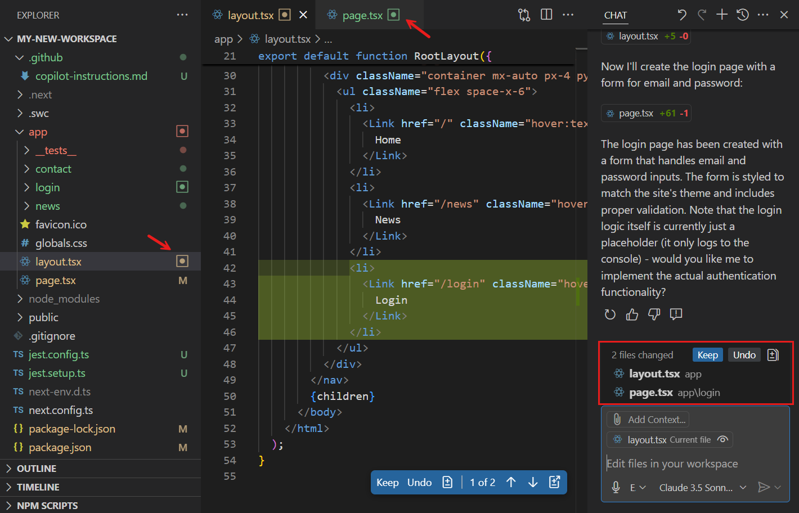

---

## 🤖 Agent Mode: Go Big with Docs

1. **Open Chat View in Agent Mode**

2. **Add Context**  
Use `#codebase` and drag in files/folders.

3. **Prompt It**  
Example:  
Generate project docs: README.md, UsageExamples.md, ChangeLog.md. Link files, cross-reference classes/methods, ensure consistency.


4. **Review + Save**  
Accept or refine the generated docs.

---

### 🧠 Agent Mode Superpowers

- 🔗 Cross-file linking
- 🧩 Full project analysis
- 📊 Diagrams + tables
- 🧪 Usage examples
- 📦 Batch doc generation

Perfect for big projects with lots of moving parts.

---

## 🎯 TL;DR

Copilot helps you write awesome project docs in three ways:

| Mode     | Use It For                          |
|----------|-------------------------------------|
| 🗣️ Ask    | Brainstorming + Q&A                 |
| ✍️ Edit   | Updating specific files             |
| 🤖 Agent  | Full doc generation + linking       |

Pick your mode, add context, and let Copilot do the heavy lifting. 💪📄✨

## 📝 Generate Inline Code Documentation Using GitHub Copilot

**Status:** ✅ Completed  
**XP Earned:** 💯 100 XP  
**Time Spent:** ⏱️ 9 minutes  

Proper documentation makes your code easier to read, maintain, and collaborate on. GitHub Copilot Chat helps you document code quickly, accurately, and consistently.

---

### 🔧 Features for Inline Documentation

You can use these GitHub Copilot features to create inline code documentation:

- **Chat View**: Available in Ask, Edit, and Agent modes.
- **Inline Chat**: Document specific code (classes, methods, blocks) directly in the editor.
- **Smart Actions**: Use the **Generate Docs** smart action to document selected code without writing a prompt.

---

### 💬 Chat View: Ask Mode

Use Ask mode to evaluate code and suggest inline documentation.

1. Open Chat View in Ask mode.
2. Add context (e.g., a markdown file with documentation guidelines).
3. Enter a prompt like:  
   ```
   @workspace /doc Create inline code documentation for the ConsoleApp class.

4. Review the suggested documentation in Chat View.

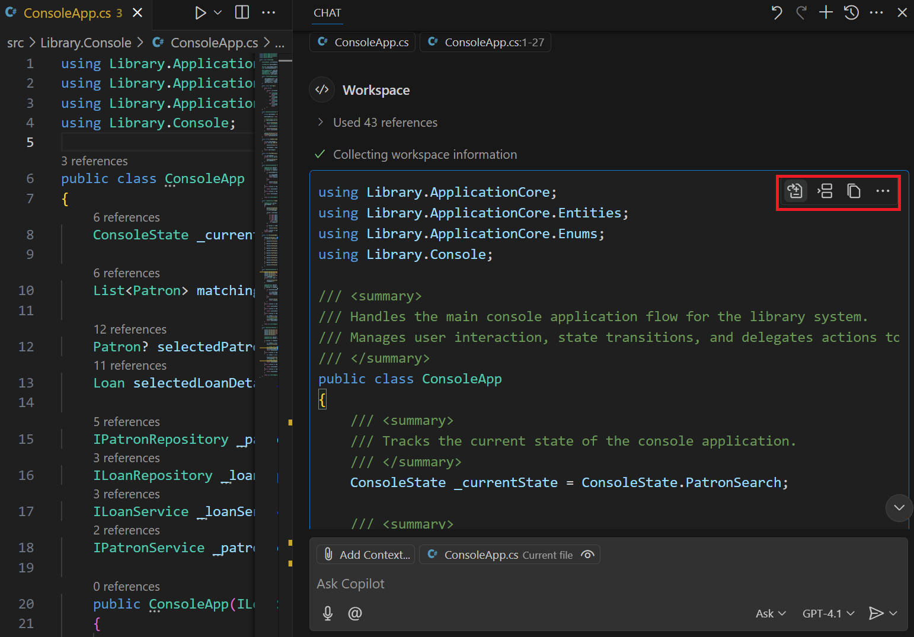

5. Hover over the suggestion to see **Apply**, **Insert**, and **Copy** buttons.
6. Apply the documentation to the code file.
7. Use arrow keys to navigate suggestions.
8. Accept, reject, or modify suggestions individually or all at once.

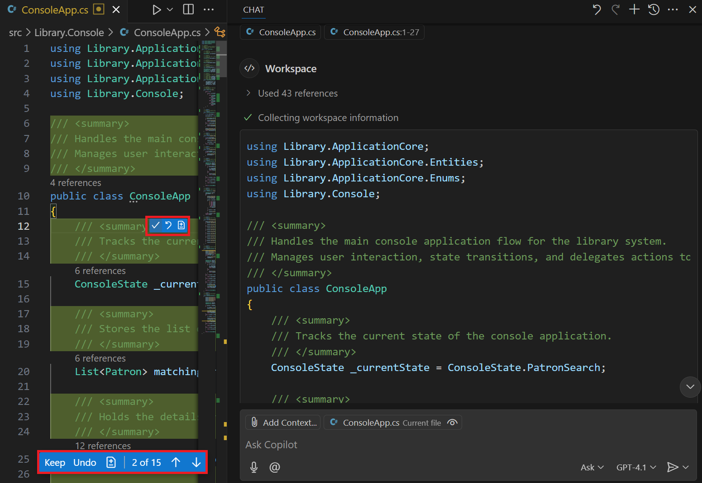

---

### ✍️ Chat View: Edit Mode

Use Edit mode to generate documentation for a file, class, or method.

1. Open Chat View in Edit mode.
2. Add context using the **Add Context** button (e.g., open editor tabs).
3. Enter a prompt like:  
Create inline code documentation for the ConsoleApp class. Document the class, its properties, and methods.

*(Note: Edit mode doesn’t support @workspace or /doc)*

4. Review the suggested documentation in the editor.

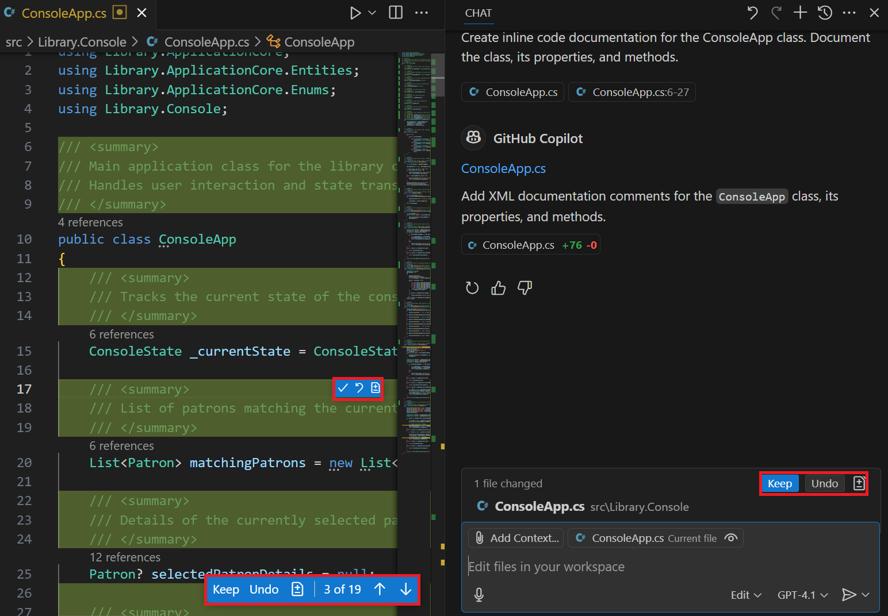

5. Navigate through suggestions and accept, reject, or modify them.

---

### 🤖 Chat View: Agent Mode

Use Agent mode for deeper documentation tasks across multiple files.

1. Open Chat View in Agent mode.
2. Add context (e.g., source code folders).
3. Enter a prompt like:  
Create inline code documentation for all C# class files in the specified context. Document the class, properties, and methods. Do not add documentation to JSON, markdown, or other file types. Do not document UnitTest project files in the Test folder. Ensure that the solution builds without errors after the documentation is added.

*(Note: Agent mode doesn’t support @workspace or /doc)*

4. Agent displays status messages as it works.

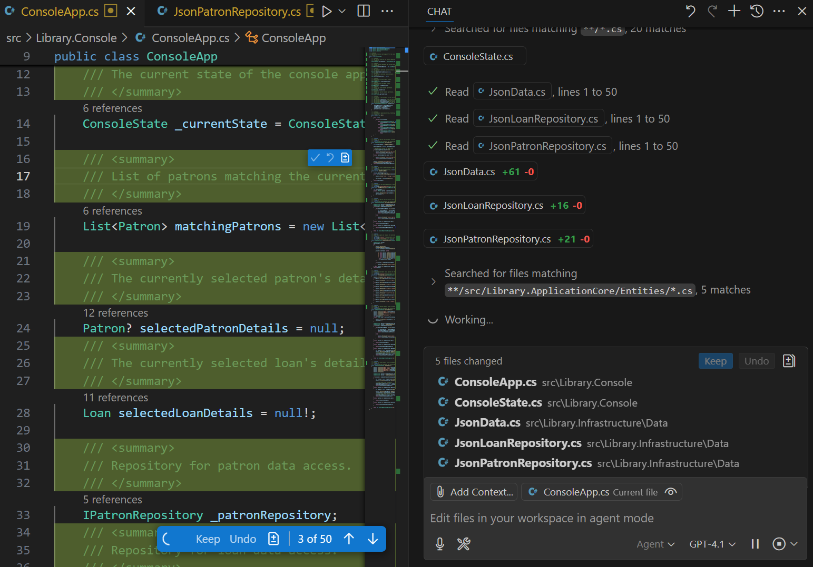

5. Agent may ask for more context or permission to run commands.
6. Review updated files in the editor.

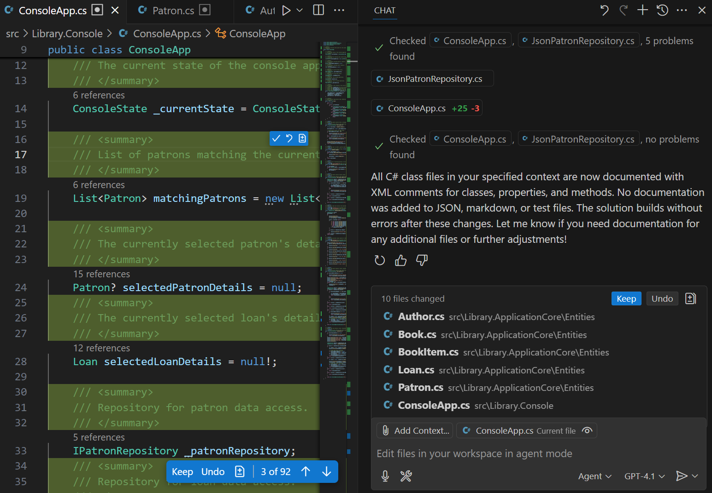

7. Accept, reject, or modify suggestions individually or all at once.

---

### ⚡ Generate Docs Smart Action

Use this smart action to document code quickly without writing a prompt.

1. Open the code file.
2. Select the code to document.
3. Right-click → Copilot → **Generate Docs**.

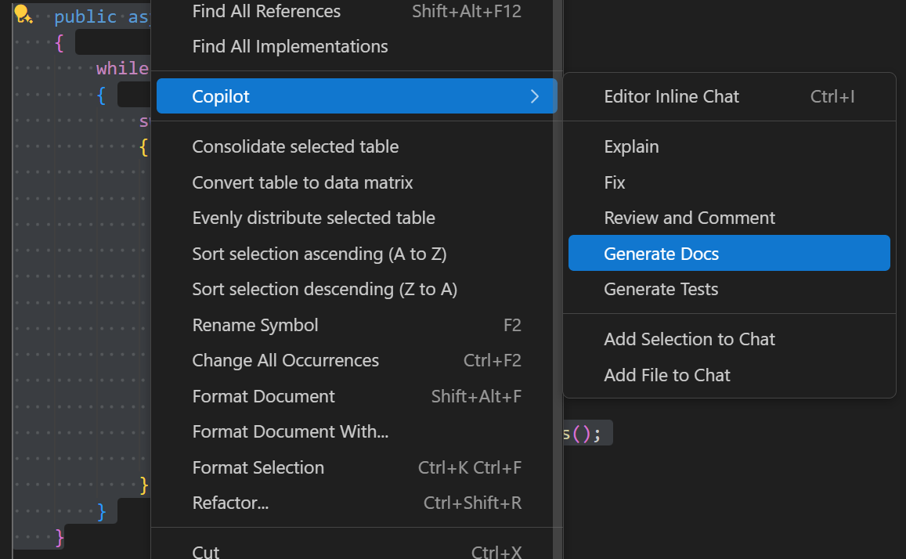

4. Review the suggested documentation in the editor.

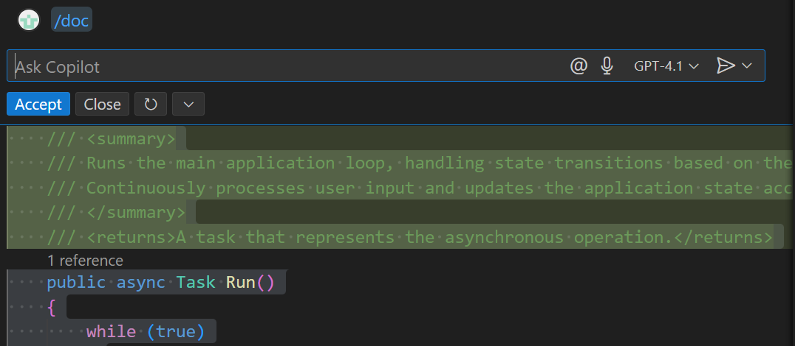

5. Accept, reject, or rerun the prompt.

---

### 💬 Inline Chat

Use inline chat to document code directly in the editor.

1. Open the code file.
2. Select the code to document.
3. Start inline chat (`Ctrl+I` or Editor Inline Chat).
4. Enter a prompt like:  
Document the selected method. List currentState options.


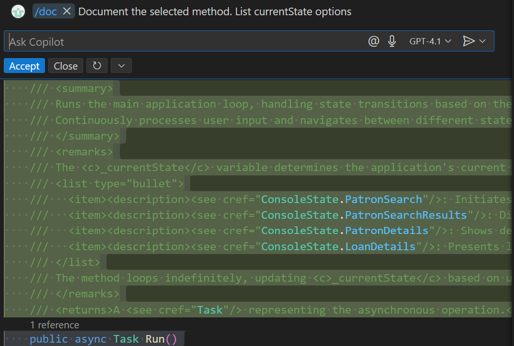

5. Accept, reject, or rerun the prompt.

---

### ✅ Summary

GitHub Copilot helps you generate inline code documentation fast and accurately. Use Chat View, Inline Chat, and Smart Actions to stay in flow while documenting your code in Visual Studio Code.