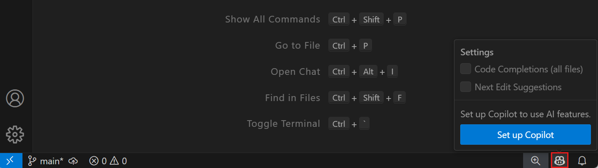
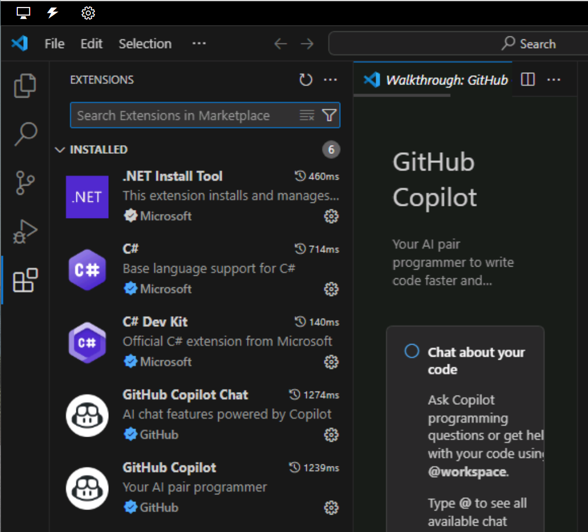

# 💻🔥 AI Dev Tools: GitHub, OpenAI & Microsoft

---

## 🚀 Why AI Tools Are Lit for Devs

AI tools are the GOAT for coding rn. GitHub, OpenAI, and Microsoft dropped some 🔥 tools that help devs go from 💡 idea to 💾 secure code. They boost speed, cut errors, and make dev life way easier. But fr, picking the right one is kinda a maze.

---

## 🧠 What’s in This Unit?

We’re vibing with these tools:

- Azure AI Services  
- Azure AI Foundry Portal  
- AI Builder  
- Copilot Studio  
- Semantic Kernel SDK  
- Visual Studio IntelliCode  
- ChatGPT  
- GitHub Copilot  

---

## ☁️ Azure AI Services

Cloud-based AI magic. No ML degree needed. Handles speech, vision, NLP, and decision stuff. Plug it into your app and boom—smarter UX.

### 🔧 Use it if:
- You want AI but don’t wanna build models from scratch.
- You need quick AI features like speech or image stuff.

---

## 🧪 Azure AI Foundry Portal

Drag-n-drop ML builder. No code, no stress. Works with TensorFlow & PyTorch. Build, train, deploy—all in one place.

### 🔧 Use it if:
- You wanna play with ML models without writing code.
- You’re a data nerd or dev who wants easy AI tools.

---

## 🛠️ AI Builder

Part of Power Platform. Add AI to apps with zero data science skills. Prebuilt models + custom ones = win.

### 🔧 Use it if:
- You’re a biz analyst or citizen dev.
- You wanna automate stuff like form reading or predictions.

---

## 🤖 Copilot Studio

Make chatbots that actually get you. No devs needed. Design convos, train bots, and track how they’re doing.

### 🔧 Use it for:
- Customer support, FAQs, health info, HR stuff.
- Bots that live in Teams, websites, or mobile apps.

---

## 🧩 Semantic Kernel SDK

Wanna mix AI with your own code? This SDK is your BFF. Use OpenAI, Azure, Hugging Face, etc. Build agents that do real work.

### 🔧 Use it if:
- You’re coding in C#, Python, or Java.
- You want AI to actually *do* things in your app.

---

## 🧠 Visual Studio IntelliCode

Smart code helper in VS. Learns from tons of repos. Suggests code, helps refactor, and keeps your style clean.

### 🔧 Use it if:
- You want faster, cleaner coding.
- Your team wants consistent code vibes.

---

## 💬 ChatGPT

Talk to AI like it’s your dev buddy. Great for ideas, debugging, and learning. Not perfect for coding, but solid for brainstorming.

### 🔧 Use it if:
- You need help understanding stuff.
- You’re building chatbots or assistants.

---

## 👨‍💻 GitHub Copilot + Chat

Your AI coding sidekick. Writes code, explains it, fixes bugs, and even makes test cases. Works in your IDE and GitHub.

### 🔧 Use it if:
- You want to code faster with fewer bugs.
- You need help understanding or documenting code.

---

## 🧠 TL;DR

AI tools = dev superpowers. Whether you’re a pro or just starting, these tools make coding faster, smarter, and way more fun. Pick your tool, level up, and let AI do the heavy lifting. 💪

# 🤖💥 GitHub Copilot Plans: Which One’s Your Coding Sidekick?

## 🚀 Why Copilot Is a Game-Changer

GitHub Copilot = your AI coding buddy. It vibes with all the top languages and makes devs way more productive. Microsoft + GitHub did the research—Copilot boosts your real-world coding flow big time.

Works with:
- VS Code  
- Visual Studio  
- Vim/Neovim  
- JetBrains IDEs  

---

## 💸 Copilot Plans Breakdown

### 🆓 **Copilot Free**
- For solo devs not in orgs
- Try basic AI coding help
- Limited features

### 💼 **Copilot Pro**
- Unlimited completions  
- Premium models in Copilot Chat  
- Monthly premium request allowance  
- Free for verified students, teachers, OSS maintainers

### 💎 **Copilot Pro+**
- Everything in Pro  
- More premium requests  
- Full access to all models  
- For AI power users

### 🧑‍💻 **Copilot Business**
- For orgs on GitHub Free/Team or Enterprise Cloud  
- Centralized management + policy control

### 🏢 **Copilot Enterprise**
- For GitHub Enterprise Cloud users  
- All Business features + enterprise-grade extras  
- Assign plans org-wide

---

## 📊 Feature Comparison Tables

### 💰 Pricing

| Feature | Free | Pro | Pro+ | Business | Enterprise |
|--------|------|-----|------|----------|------------|
| Premium requests | 50/mo | 300/mo | 1500/mo | 300/user/mo | 1000/user/mo |
| Buy more requests | ❌ | ✅ | ✅ | ✅ | ✅ |

---

### 🧠 Agents

| Feature | Free | Pro | Pro+ | Business | Enterprise |
|--------|------|-----|------|----------|------------|
| Agent mode in VS Code | ✅ | ✅ | ✅ | ✅ | ✅ |
| Code review | Basic only | ✅ | ✅ | ✅ | ✅ |
| Extensions | ✅ | ✅ | ✅ | ✅ | ✅ |

---

### 💬 Chat

| Feature | Free | Pro | Pro+ | Business | Enterprise |
|--------|------|-----|------|----------|------------|
| Chat in IDEs | 50 msgs/mo | Unlimited | Unlimited | Unlimited | Unlimited |
| Inline chat | ✅ | ✅ | ✅ | ✅ | ✅ |
| Slash commands | ✅ | ✅ | ✅ | ✅ | ✅ |
| Chat in GitHub Mobile | ✅ | ✅ | ✅ | ✅ | ✅ |
| Chat in GitHub | ✅ | ✅ | ✅ | ✅ | ✅ |
| Chat in Windows Terminal | ✅ | ✅ | ✅ | ✅ | ✅ |
| Higher model limits | ❌ | ❌ | ✅ | ✅ | ✅ |
| Chat skills in IDEs | ❌ | ✅ | ✅ | ✅ | ✅ |

---

### 🧬 Models

| Model | Free | Pro | Pro+ | Business | Enterprise |
|-------|------|-----|------|----------|------------|
| Claude 3.5 Sonnet | ✅ | ✅ | ✅ | ✅ | ✅ |
| Claude 3.7 Sonnet | ❌ | ✅ | ✅ | ✅ | ✅ |
| Claude 3.7 Thinking | ❌ | ✅ | ✅ | ✅ | ✅ |
| Gemini 2.0 Flash | ✅ | ✅ | ✅ | ✅ | ✅ |
| Gemini 2.5 Pro | ❌ | ✅ | ✅ | ✅ | ✅ |
| GPT-4o | ✅ | ✅ | ✅ | ✅ | ✅ |
| GPT-4.1 | ✅ | ✅ | ✅ | ✅ | ✅ |
| GPT-4.5 | ❌ | ❌ | ✅ | ❌ | ✅ |
| o1 | ✅ | ✅ | ✅ | ✅ | ✅ |
| o3 | ❌ | ❌ | ✅ | ❌ | ✅ |
| o3-mini | ✅ | ✅ | ✅ | ✅ | ✅ |
| o4-mini | ❌ | ✅ | ✅ | ✅ | ✅ |

---

### 🧑‍💻 Code Completion

| Feature | Free | Pro | Pro+ | Business | Enterprise |
|--------|------|-----|------|----------|------------|
| Real-time suggestions | 2000/mo | ✅ | ✅ | ✅ | ✅ |
| Next edit suggestions | ✅ | ✅ | ✅ | ✅ | ✅ |

---

### 🎨 Customization

| Feature | Free | Pro | Pro+ | Business | Enterprise |
|--------|------|-----|------|----------|------------|
| Repo & personal instructions | ✅ | ✅ | ✅ | ✅ | ✅ |
| Org instructions (preview) | ❌ | ❌ | ❌ | ❌ | ✅ |
| Prompt files | ✅ | ✅ | ✅ | ✅ | ✅ |
| Private extensions | ✅ | ✅ | ✅ | ✅ | ✅ |
| Code review guidelines | ❌ | ❌ | ❌ | ❌ | ✅ |
| Block public code suggestions | ✅ | ✅ | ✅ | ✅ | ✅ |
| Exclude files | ❌ | ❌ | ✅ | ✅ | ✅ |
| Org-wide policy mgmt | ❌ | ❌ | ✅ | ✅ | ✅ |

---

### 🧩 Other Features

| Feature | Free | Pro | Pro+ | Business | Enterprise |
|--------|------|-----|------|----------|------------|
| PR summaries | ❌ | ✅ | ✅ | ✅ | ✅ |
| Audit logs | ❌ | ❌ | ✅ | ✅ | ✅ |
| Knowledge bases | ❌ | ❌ | ❌ | ❌ | ✅ |
| Fine-tune LLM (preview) | ❌ | ❌ | ❌ | ❌ | ✅ |
| Copilot in CLI | ✅ | ✅ | ✅ | ✅ | ✅ |

---

## 🧠 TL;DR

GitHub Copilot’s got a plan for everyone—from solo devs to mega enterprises. Pick the one that fits your vibe, your team, and your coding goals. 💻✨

# 🧠⚡ GitHub Copilot Features: What’s Hot & What’s Dropping

## 🚀 Copilot = Your AI Coding Sidekick

GitHub Copilot’s got a growing list of features for solo devs and orgs. Some are 🔒 exclusive, others are 🔓 public preview. What you get depends on your plan.

---

## 🧩 Core Features (General Availability)

### ✨ Code Completion
- Autocomplete vibes in VS Code, Visual Studio, JetBrains, Azure Data Studio, Xcode, Vim/Neovim, Eclipse.
- In VS Code: “Next edit suggestions” predict your next move and help you code faster.

---

### 💬 Copilot Chat
- Ask coding Qs, update files, get help.
- Available in GitHub Web, GitHub Mobile, IDEs (VS Code, Visual Studio, JetBrains, Eclipse, Xcode), and Windows Terminal.
- GitHub Skills in Chat (not in Free plan).

---

### 🛠️ Copilot Edits
Edit across files from one chat prompt.

- **Edit Mode**: You control the files, context, and edits.
- **Agent Mode**: Copilot takes the wheel, edits code, runs terminal commands, and fixes stuff until the task’s done. (Only in VS Code)

---

### 🔍 Code Review
AI-powered suggestions to help you write cleaner, smarter code.

---

### 🧑‍💻 Copilot in the CLI
Chat with Copilot in your terminal. Ask for command help, get suggestions, and explanations. Works in Windows Terminal Canary too.

---

### 📦 Pull Request Summaries
Copilot auto-generates summaries of PR changes, impacted files, and review tips. (Not in Free plan)

---

### 🧪 Copilot Extensions
Plug external tools into Copilot Chat via GitHub Apps. Build your own or grab from GitHub Marketplace.

---

### 🧠 Custom Instructions
Tell Copilot your coding style, tools, and preferences to get better responses.

---

### 📚 Knowledge Bases (Enterprise Only)
Create doc collections to use as context in Copilot Chat. Ask smarter questions in GitHub or VS Code.

---

## 🧠 TL;DR

Copilot’s stacked with features to level up your coding game. From smart suggestions to full-on AI agents, it’s built to boost your dev flow. What you get depends on your plan, but even the basics are 🔥.

# ⚙️🧠 GitHub Copilot Setup: Get Your AI Coding Buddy Online

---

## 👤 Setup for Solo Devs

### 🔍 Pick Your Plan
- **Copilot Free**: 2K completions + 50 chats/month. No 💸 needed.
- **Copilot Pro**: 30-day free trial + 300 premium requests/month.
- **Copilot Pro+**: 1500 premium requests + full model access.
- **Org/Enterprise Access**: Ask your team for access.
- **Students/Teachers/OSS Maintainers**: You might get it free!

---

### 🧩 Install the Extension
Copilot works in:
- VS Code  
- Visual Studio  
- JetBrains IDEs  
- Vim/Neovim  
- Eclipse  
- Xcode  

### 💻 CLI & Terminal Setup
- Install Copilot for GitHub CLI  
- Use Copilot Chat in Windows Terminal Canary  

---

### 🌐 Networking Setup (If Needed)
- Add key URLs to proxy/firewall allowlist  
- Install custom SSL certs if required  

---

### ⚙️ Optional Settings
- Tweak Copilot settings in IDE or CLI  
- Add Copilot Extensions  
- Manage your own policies  

---

## 🏢 Setup for Organizations

### 💼 Subscribe Your Org
- Choose **Copilot Business** or **Copilot Enterprise**
- Enterprise owners can enable org-wide access

### 🔐 Set Policies
- Control which features are available

### 🌐 Networking Setup
- Add key URLs to allowlist  
- Install SSL certs on member machines  

### 👥 Grant Access
- Enable Copilot for key teams first  
- Use self-service license claiming for smooth rollout  
- Enterprise users need to authenticate from their IDE  

---

### 🚀 Drive Adoption
- Plan your rollout  
- Start with excited teams  
- Show early wins  

---

### 🔧 Enhance the Experience
- Set up knowledge bases (Enterprise only)  
- Fine-tune with custom LLMs  
- Add Copilot Extensions  

---

## 🆓 Copilot Free Access

### 🚫 Not Available If:
- You’re a managed user  
- You’re assigned via org  
- You already have Pro/Pro+ or trial  
- You’re using a free Pro plan as a student/teacher/maintainer  

### ✅ How to Start:
- **VS Code / Visual Studio**: Sign up from the editor  
- **GitHub Web**: Go to Settings → Your Copilot → Start using Copilot Free  
- **GitHub Mobile**: Tap the Copilot icon → Ask Copilot  
- **Other IDEs**: Activate from GitHub → Pick your editor → Install  

---

## 🧠 TL;DR

Copilot setup = easy mode.  
Solo devs: pick a plan, install, tweak settings.  
Orgs: subscribe, set policies, roll it out smart.  
Copilot’s ready to code with you. 💻🔥

# ⚙️🧠 GitHub Copilot in VS Code: Setup & Settings

---

## 🚀 What’s the Deal?

Copilot plugs straight into VS Code, Visual Studio, and other IDEs. In VS Code, it uses **two extensions**:

- **GitHub Copilot**: Handles code completions + comment-based suggestions  
- **GitHub Copilot Chat**: Lets you chat with your AI coding buddy  

---

## 🔧 Install Copilot in VS Code

No manual install needed—Copilot extensions auto-install with default settings.

### 🛠️ Steps:
1. Open VS Code (make sure it’s updated)
2. Hover over the Copilot icon in the Status Bar → click **Set up Copilot**



3. Hit **Sign in** to log into GitHub  
   - Already signed in? You’ll see **Use Copilot** instead  
4. Follow the prompts to authenticate + authorize  
5. Boom! Extensions install in the background  

📍 You can find them in the **Extensions view** in VS Code.


---

## ⚙️ Configure Copilot Settings

Customize how Copilot behaves in VS Code.

### 🧩 Access Settings:
- Click the ⚙️ **Manage** icon (bottom-left corner)
- Select **Settings**

### 🔧 Extension Settings:
- **Copilot Extension**: Manage languages + AI models  
- **Copilot Chat Extension**: Control chat interactions  


---

## 🧠 TL;DR

Copilot in VS Code = plug & play.  
Two extensions, auto-installed.  
Customize settings to match your coding vibe.  
Let AI help you code smarter, faster, better. 💻🔥

# 🛠️👤 GitHub Copilot: Manage Your Plan Like a Pro

---

## 🚀 What You Can Control

If you're flying solo (not in an org plan), you’ve got full control over your Copilot setup. You can:

- Manage your plan  
- Tweak your settings  
- Add extensions  
- Control privacy & features  

> ⚠️ If you’re part of an org with Copilot Business/Enterprise, some settings might be locked. Talk to your account manager.

---

## ⚙️ Feature Toggles

### 🔧 Enable/Disable Stuff:
- **Copilot Chat in GitHub**  
- **Copilot Chat in GitHub Desktop**  
- **Web Search via Bing**  
- **Alt AI Models**: Claude Sonnet, Gemini  

### 🔐 Privacy Settings:
- **Block public code matches**  
  - Copilot checks ~150 chars of your code against public GitHub code  
  - If matched, it won’t show the suggestion  
- **Allow public code matches**  
  - See match details + repo links  
- **Prompt/Suggestion Collection**  
  - Opt in/out of GitHub using your snippets for product improvements  
- **Model Training**  
  - Your data won’t be used for training—this is locked off by default  

---

## 🧩 Extensions FTW

### 🔌 Copilot Extensions:
- Add extra tools via GitHub Marketplace  
- Must have Copilot Free, Pro, or Pro+ to use  
- Org users don’t need to install—admins handle it  

### 🛠️ Build Your Own:
- Create custom Copilot Extensions for your personal account  

---

## ⚠️ Know the Limits

### 📉 Performance Vibes:
- Scope is limited—some languages or complex code may trip it up  
- JavaScript = 🔥, niche languages = 🤷‍♀️  

### 🧠 Bias Alert:
- Trained on public code = possible bias or errors  
- May favor certain styles or languages  

### 🔐 Security Watch:
- Generated code might leak sensitive info  
- Always test + review before deploying  

### 🧪 Public Code Matches:
- Low chance, but not zero  
- Treat Copilot code like any third-party snippet  
- Run IP scans, security checks, and manual reviews  

### ❌ Inaccurate Code:
- Looks good ≠ works good  
- Review for syntax, logic, and architecture fit  

### 🤖 Non-Code Qs:
- Copilot Chat isn’t built for general knowledge  
- Might give weird or wrong answers  

---

## 🧠 TL;DR

You’ve got the power to shape your Copilot experience.  
Toggle features, manage privacy, install extensions, and stay smart about what Copilot generates.  
Use it like a pro, test everything, and keep your code clean. 💻🔥

## 🚀 GitHub Copilot: Code Completion Cheat Sheet

---

### 🔮 What Copilot Does

GitHub Copilot is like your coding BFF. It watches what you type and throws in smart code suggestions — kinda like autocomplete but way smarter.

You’ll get suggestions when you:
- Type part of a code line 💻
- Write a comment 🗯️
- Leave a blank line ⬜

---

### ⚡ Speed Boost for Devs

Say you’re writing a C# method called `addInt` to add two numbers. Start typing and boom 💥 — Copilot finishes it for you.


No syntax colors = Copilot’s suggestion. Hit `Tab` to accept.  
Hit `Esc` to say “nah.”

---

### 🧠 Smarter Than It Looks

Let’s level up. You want a method that adds only prime numbers from a list. Start typing `addPrimeNumbersInNumericList` and Copilot’s got your back.


Looks good? Hit `Tab`.  
But wait — `isPrime` is red ❌. It’s missing.


Copilot knows best practices. It suggests you write `isPrime` separately.


---

### 🛠️ Managing Suggestions

Hover over a suggestion and you’ll see:
- ✅ Accept (or press `Tab`)
- 🧩 Accept Word (`Ctrl + >`)
- 🔄 View others (`Alt + ]` or `Alt + [`)

Want more control? Click `...` for:
- 📏 Accept Line
- 📌 Always Show Toolbar
- 🧭 Open Completions Panel


---

### 💬 Comments = Code

Copilot reads your comments like magic spells 🪄.  
Write something like:

```csharp
// create a list of 100 random numbers between 1 and 1000
Copilot finishes the comment and starts generating code.
```

When you start entering the comment, GitHub Copilot suggests an autocompletion that completes the comment for you.


Accept each line as it appears.


When you create a new code line after the comment, GitHub Copilot begins generating a code snippet based on the comment and your existing code.


Accept each of the suggestions as they appear.


If GitHub Copilot isn't done, it generates another suggestion for you to accept.


If you enter a new code line after the code snippet is complete, GitHub Copilot generates another autocomplete suggestions based on the requirements of your code project


🧭 Explore More Suggestions
Not vibing with the first suggestion?
Press Ctrl + Enter or open the More Actions menu → Open Completions Panel.


You’ll see up to 10 options. Pick your fave or close the tab to reject all.

🧾 TL;DR
Copilot helps you code faster and smarter:

Type code, comments, or blank lines to get suggestions.
Accept with Tab, dismiss with Esc.
Use the toolbar to manage suggestions.
Comments can trigger full code snippets.
Open the Suggestions tab for more options.
